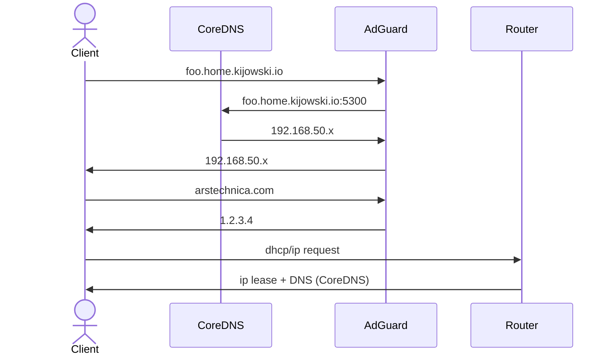

```mermaid
sequenceDiagram
    actor u as Client
    participant cd as CoreDNS
    participant ag as AdGuard
    participant r as Router

    u->>ag: foo.home.kijowski.io
    ag->>cd: foo.home.kijowski.io:5300
    cd->>ag: 192.168.50.x
    ag->>u: 192.168.50.x

    u->>ag: arstechnica.com
    ag->>u: 1.2.3.4

    u->>r: dhcp/ip request
    r->>u: ip lease + DNS (CoreDNS)
```
