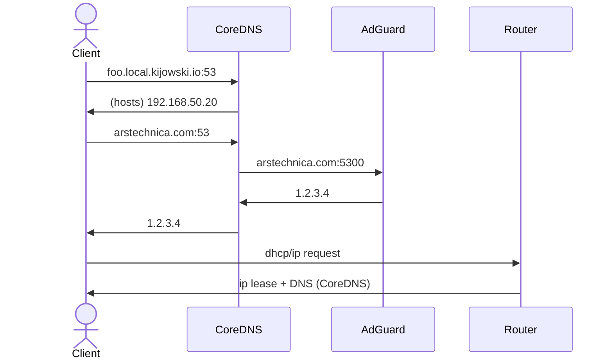

```mermaid
sequenceDiagram
    actor u as Client
    participant cd as CoreDNS
    participant ag as AdGuard
    participant r as Router

    u->>cd: foo.local.kijowski.io:53
    cd->>u: (hosts) 192.168.50.20

    u->>cd: arstechnica.com:53
    cd->>ag: arstechnica.com:5300
    ag->>cd: 1.2.3.4
    cd->>u: 1.2.3.4

    u->>r: dhcp/ip request
    r->>u: ip lease + DNS (CoreDNS)
```
