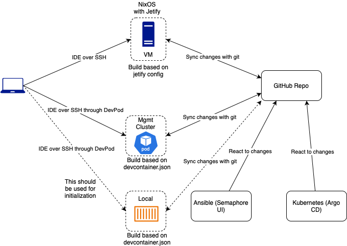

# Development

The preferred way to work in this repo is through a virtualized environment.
There are many advantages to this, namely being able to control the applications and their dependencies.
Also, the ideal home lab is:

- easily reproducable
- declarative
- practices git-ops for change management

That should include the development environment.

However there is a chicken-and-egg scenario at play.

> I need the tools to create the environment, which has the tools to work in the environment.

## Design

The current approach for a development environment:

## Initialization

In order to bootstrap a new environment from scratch, the host machine will need the following applications:

- container runtime i.e. [Podman] or Docker
- [Devcontainer] compatible platform such as [Devpod]

With these tools in place it is now possible to create a development environment in a locally running dev container.

1. Use [Devpod] to create a local container based on `.devcontainer/devcontainer.json`
1. Use Ansible to create the k3s management (mgmt) cluster
1. Deploy ArgoCD in to the management cluster
1. Deploy SemaphoreUI in to the management cluster

From this point ArgoCD and Semaphore can be configured to synchronize changes from the project repository.

Additionally, the management cluster can be used as a dev container provider, replacing the local container environment.

## Future

On-going development can continue to use the dev container in the managment cluster.

However, another option is to create a development VM within the network.
An OS such as [NixOS] can be used to declaritively configure this system with the tools needed.
Additionally, a tool such as [Jetify] can be added to further declare dependencies and ensure repeatable development environments.

[Devcontainer]: https://containers.dev
[Podman]: https://podman.io
[Devpod]: https://devpod.sh
[NixOS]: https://nixos.org
[Jetify]: https://www.jetify.com
